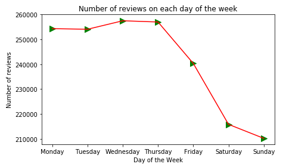

# Predicting Helpfulness of Amazon Electronics Product Reviews using Text Analytics and Topic modeling using Mallet

__Models Tried for predicting helpfulness:__
* Support Vector Machine (SVM) Classification
* Naive Bayes Gaussian Classifier

__Statistics from the data:__
* Number of unique products (asin) that had reviews = 63001
* Number of unique reviewers (reviewerID) who wrote the reviews = 192403
* 'Amazon Customer' is the most common reviewer name since some users have enforced hiding their name in reviews for privacy.
* 'SanDisk Ultra 64GB MicroSDXC Class 10 UHS Memory Card Speed' is the Electronic product that had the most reviews with around 5000 reviews.
* The following plot is to check if there are some top reviewers who are there only to criticize.
Inference: No, the top 10 reviewers who has given most number of reviews, have given different ratings for the products on the whole during their reviews.  

* Customers' Ratings Distribution shows that majority of the customers give 5-Star rating.  

* There seems to be positive relationship between the upvotes and downvotes.  

The difference between the number of upvotes and downvotes doesn't seem to be much.  

* The reviews were from June 1999 to July 2014.  

* Zooming on the graph created using  plotly and cufflinks, we can search for specific dates. Seems the highest number of reviews were contributed on Jan 7th, 2014.  

* Most reviews are contributed on Wednesdays closely followed by Thursdays.  

__Support Vector Machines:__
Support Vector Machines helps in both linear and non linear classification and can handle mid to large level datasets. Hence it is suitable for our data.
Different SVM parameters of the SVC Classifier from from sklearn.svm library was used. The parameters used were 'C' - the parameter to set the extent to which the misclassification is penalized and 'gamma' - the kernel Trick for complexity of SVM.
The default parameter of kernel='rbf' and decision_function_shape='ovr' were preferred because they seem to be best parameter for our data. Kernel 'rbf' (Radial basis function) is the most commonly used kernel. Our data is expected to not perform well for Linear, Polynomial or Sigmoid classification. Hence choosing RBF Kernel. Since our target variable 'helpful_review' has only 2 classes 1 & 0, both the possible values of the parameter 'decision_function_shape' will perform the same.
	'ovr' - (one-vs-rest) tries to separate one class from the other class. Hence makes only 1 classification. Were there 5 classes, ovr makes 4 classification, i.e, trying to separate one class from the remaining 4 classes and repeating the process for 3 classes until only one class is left.
	'ovo' - (one-vs-one) compares all classes separately. It creates hyperplane for each one of them. Hence creates 4+3+2+1 = 10 classifications when there are 5 classes. However, since our data has only 2 classes, ovo and ovr will do the same work. Hence we are going with the default 'ovr' parameter for our model.

The different values tried for the above mentioned parameters are : 
* Cs = [0.001, 0.01, 0.1, 1, 10]
* gammas = [0.001, 0.01, 0.1, 1]
A low C value prioritizes simplicity and will create a wide hyperplane layer (soft margin). This causes more margin violation of the support vectors present in the edges of the boundary. Hence a low C value causes more misclassification. A high C value prioritizes to make fewer mistakes and will create a narrow hyperplane layer. This causes less margin violation of the support vectors in the training data.

A low gamma value will create a wide bell-shaped curve and hence a smooth decision boundary. On the other hand, a high gamma value will create a narrow bell-shaped curve and hence a irregular boundary. In between this under-fitting and over-fitting issues, GridSearchCV function from scikit-learn's model_selection library  helps to find the correct fitting model for our data.

Having 3-folds in our Cross Fold Validation, 5 possible values of Cs and 4 possible values, a told of 3*5*4 = 60 combinations will be tried to find the best parameters. The best parameter was identified as {'C': 1, 'gamma': 0.01}.
Our model without the 100 most common words yielded an accuracy of 80% and the the model with 100 most common words included, yielded an accuracy of 84%.
The 100 most common words helped to correctly classify more unhelpful reviews.
A 83% precision shows that out of all the reviews in test data that were predicted as helpful, 83% of them are actually helpful.
A 98% recall tells that out of all the reviews in the test data that are actually helpful, 98% of them were predicted correctly.
A f-score of 0.89 shows that the performance of the model is good since the value is close to 1.

__Topic Modelling__:
We also inferred topics from the keywords as shown below:
* Topic 1 - Good Mounting features of Garmin ‘Nuvi’ GPS
* Topic 2 - Post sale service and updates
* Topic 3 - Compatibility of GPS devices internationally particularly Europe
* Topic 4 - General Features of GPS
* Topic 5 - Geocache coordinates 
* Topic 6 - Driving features of Garmin GPS
* Topic 7 - Bad customer service 
* Topic 8 - Garmin Smart Watch features

__Conclusion:__  
The accuracy of our Random Forest Classification is 81% while our Naive Bayes Classification is only 70%. We were able to generate the best Random Forest Classifier by hyper-parameter tuning. However we did could not do hyper-parameter tuning on the Naive Bayes classifier as it is so naive that it doesn't accept parameters except priors which we don't know.
